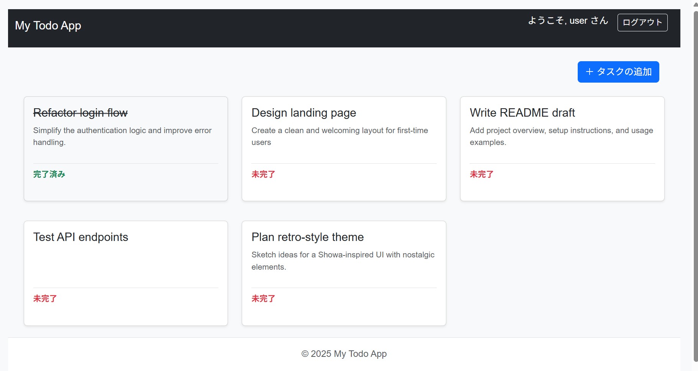

# My Todo App

これは Spring Boot を使用して作成されたシンプルなToDoアプリケーションです。

## 概要

ユーザーはアカウントを登録し、ログインして自身のタスクを管理（作成、表示、更新、削除）することができます。

## スクリーンショット



## 主な機能

*   ユーザー認証（登録・ログイン）
*   タスクのCRUD（作成・一覧表示・詳細表示・更新・削除）
*   スマートフォン・タブレット対応のレスポンシブデザイン

## 使用技術

*   **バックエンド:**
    *   Java 21
    *   Spring Boot 3.5.5
    *   Spring Web
    *   Spring Security
    *   Spring Data JPA
*   **フロントエンド:**
    *   Thymeleaf
    *   Bootstrap
*   **データベース:**
    *   H2 Database (インメモリ)
*   **ビルドツール:**
    *   Gradle

## セットアップと実行方法

1.  リポジトリをクローンします。
    ```bash
    git clone https://github.com/semantic-honu/my-todo-app.git
    cd my-todo-app
    ```

2.  以下のコマンドでアプリケーションを起動します。
    ```bash
    ./gradlew bootRun
    ```

3.  ブラウザで `http://localhost:8080` にアクセスします。

## サードパーティライセンス

このプロジェクトは以下のオープンソースソフトウェアを使用しています。

*   **Spring Framework:** [Apache License 2.0](https://www.apache.org/licenses/LICENSE-2.0)
*   **Thymeleaf:** [Apache License 2.0](https://www.apache.org/licenses/LICENSE-2.0)
*   **H2 Database Engine:** [Mozilla Public License 2.0](https://www.mozilla.org/en-US/MPL/2.0/)
*   **Bootstrap:** [MIT License](https://opensource.org/license/MIT)

各ライブラリの詳細なライセンス情報については、それぞれの公式サイトをご確認ください。